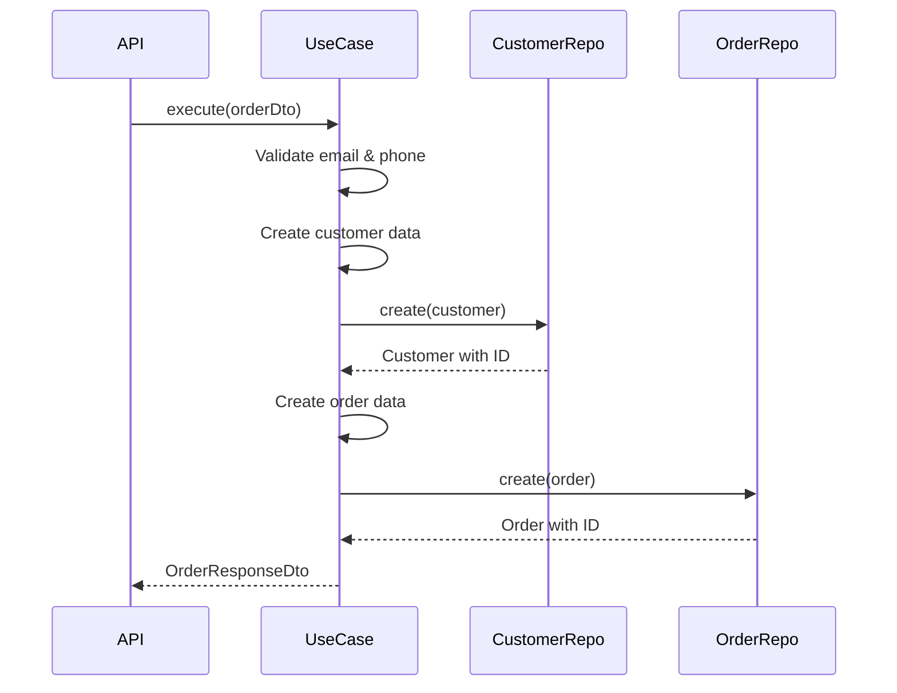
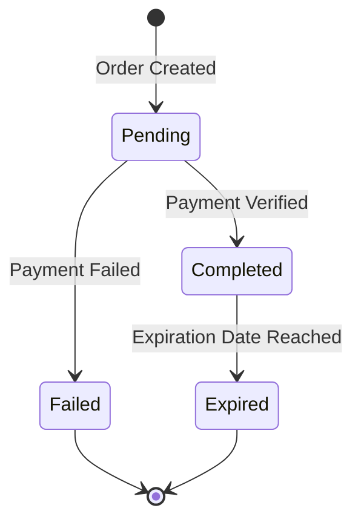

## Overview

Connect World's order management system handles the complete subscription lifecycle, from customer creation through payment processing to subscription activation and expiration tracking.

<CardGroup cols={3}>
  <Card title="Order Creation" icon="plus">
    Secure order processing with validation
  </Card>
  <Card title="Customer Management" icon="user">
    Automatic customer profile creation
  </Card>
  <Card title="Status Tracking" icon="list-check">
    Real-time order status updates
  </Card>
</CardGroup>

## Order Entity

### Order Interface

```typescript
export type PaymentMethod = "stripe" | "paypal";
export type OrderStatus = "pending" | "completed" | "failed";

export interface Order {
  id?: string;
  customerId: string;
  planId: string;
  devices: number;
  months: number;
  amount: number;
  paymentMethod: PaymentMethod;
  paymentReceiptId: string;
  status: OrderStatus;
  activationDate: Date;
  expirationDate: Date;
  createdAt?: Date;
}
```

Source: `src/domain/entities/Order.ts:1-17`

<Tabs>
  <Tab title="Order Status">
    ### Order Status Types
    
    Orders can have three status values:
    
    - **pending**: Order created but payment not yet confirmed
    - **completed**: Payment confirmed and subscription active
    - **failed**: Payment failed or order could not be processed
    
    ```typescript
    export type OrderStatus = "pending" | "completed" | "failed";
    ```
    
    Source: `src/domain/entities/Order.ts:2`
  </Tab>
  
  <Tab title="Payment Methods">
    ### Supported Payment Methods
    
    Orders support two payment gateways:
    
    ```typescript
    export type PaymentMethod = "stripe" | "paypal";
    ```
    
    Source: `src/domain/entities/Order.ts:1`
    
    <Note>
      The payment method is validated server-side against the allowed enum values to prevent invalid payment types.
    </Note>
  </Tab>
</Tabs>

## Order Creation

### Factory Function

Orders are created using a factory function that automatically calculates activation and expiration dates:

```typescript
export function createOrder(data: Omit<Order, "id" | "createdAt" | "activationDate" | "expirationDate">): Order {
  const activationDate = new Date();
  const expirationDate = new Date();
  expirationDate.setMonth(expirationDate.getMonth() + data.months);

  return {
    ...data,
    activationDate,
    expirationDate,
    createdAt: new Date(),
  };
}
```

Source: `src/domain/entities/Order.ts:19-30`

<Accordion title="Date Calculation Logic">
  - **activationDate**: Set to current date/time when order is created
  - **expirationDate**: Calculated by adding the subscription duration (months) to the activation date
  - **createdAt**: Timestamp of order creation
  
  Example: A 6-month subscription created on January 1st will:
  - activationDate: 2026-01-01
  - expirationDate: 2026-07-01
</Accordion>

## Order API Endpoint

### Order Creation Endpoint

The `/api/orders` endpoint handles complete order creation with comprehensive security measures:

```typescript
export async function POST(req: NextRequest) {
  // Rate limit: 5 order creations per IP per 10 minutes (anti-spam)
  const ip = getClientIp(req);
  if (!checkRateLimit(`orders:${ip}`, 5, 10 * 60 * 1000)) {
    return NextResponse.json(
      { error: "Demasiadas solicitudes. Intenta de nuevo en unos minutos." },
      { status: 429 }
    );
  }

  try {
    const body = await req.json();

    // Honeypot: bots fill hidden fields humans don't see
    if (body._hp && body._hp !== "") {
      // Silently reject — return fake success so bots don't retry aggressively
      return NextResponse.json({ orderId: "bot", expirationDate: new Date().toISOString() }, { status: 201 });
    }

    // Sanitize and validate every field
    const name  = sanitizeString(body.name, 100);
    const email = sanitizeEmail(body.email);
    const phone = sanitizePhone(body.phone);
    const planId = sanitizeString(body.planId, 50);
    const devices = sanitizeNumber(body.devices, 1, 10);
    const months  = sanitizeNumber(body.months, 1, 12);
    const amount  = sanitizeNumber(body.amount, 1, 10000);
    const paymentMethod = sanitizeEnum<PaymentMethod>(body.paymentMethod, PAYMENT_METHODS);
    const paymentReceiptId = sanitizeString(body.paymentReceiptId, 200);

    // Validation and order creation...
  } catch (error: unknown) {
    // Error handling...
  }
}
```

Source: `src/app/api/orders/route.ts:19-97`

### Rate Limiting

<Warning>
  **Anti-Spam Protection**: Orders are rate-limited to 5 creations per IP per 10 minutes to prevent abuse.
</Warning>

```typescript
if (!checkRateLimit(`orders:${ip}`, 5, 10 * 60 * 1000)) {
  return NextResponse.json(
    { error: "Demasiadas solicitudes. Intenta de nuevo en unos minutos." },
    { status: 429 }
  );
}
```

Source: `src/app/api/orders/route.ts:21-27`

### Honeypot Protection

The endpoint implements honeypot fields to catch bots:

```typescript
// Honeypot: bots fill hidden fields humans don't see
if (body._hp && body._hp !== "") {
  // Silently reject — return fake success so bots don't retry aggressively
  return NextResponse.json({ orderId: "bot", expirationDate: new Date().toISOString() }, { status: 201 });
}
```

Source: `src/app/api/orders/route.ts:32-36`

<Note>
  Honeypot fields are hidden in the UI. Legitimate users don't see or fill them, but bots often auto-fill all fields. The endpoint returns a fake success response to avoid triggering aggressive bot retries.
</Note>

## Input Validation

### Comprehensive Field Validation

Every field is sanitized and validated before processing:

```typescript
const name  = sanitizeString(body.name, 100);
const email = sanitizeEmail(body.email);
const phone = sanitizePhone(body.phone);
const planId = sanitizeString(body.planId, 50);
const devices = sanitizeNumber(body.devices, 1, 10);
const months  = sanitizeNumber(body.months, 1, 12);
const amount  = sanitizeNumber(body.amount, 1, 10000);
const paymentMethod = sanitizeEnum<PaymentMethod>(body.paymentMethod, PAYMENT_METHODS);
const paymentReceiptId = sanitizeString(body.paymentReceiptId, 200);
```

Source: `src/app/api/orders/route.ts:39-47`

### Validation Rules

<CardGroup cols={2}>
  <Card title="Plan Validation" icon="check-double">
    ```typescript
    const plan = PLANS.find((p) => p.id === planId);
    if (!plan) {
      return NextResponse.json(
        { error: "Plan inválido." },
        { status: 400 }
      );
    }
    ```
    
    Source: `src/app/api/orders/route.ts:54-57`
  </Card>
  
  <Card title="Duration Validation" icon="clock">
    ```typescript
    if (!(VALID_MONTHS as readonly number[]).includes(months)) {
      return NextResponse.json(
        { error: "Duración inválida." },
        { status: 400 }
      );
    }
    ```
    
    Source: `src/app/api/orders/route.ts:60-62`
  </Card>
  
  <Card title="Price Validation" icon="dollar-sign">
    ```typescript
    const expectedPrice = plan.prices.find(
      (p) => p.months === months
    )?.price;
    if (expectedPrice === undefined || 
        Math.abs(amount - expectedPrice) > 0.01) {
      return NextResponse.json(
        { error: "Monto inválido." },
        { status: 400 }
      );
    }
    ```
    
    Source: `src/app/api/orders/route.ts:65-68`
  </Card>
  
  <Card title="Device Validation" icon="mobile">
    ```typescript
    if (devices !== plan.devices) {
      return NextResponse.json(
        { error: "Número de dispositivos inválido." },
        { status: 400 }
      );
    }
    ```
    
    Source: `src/app/api/orders/route.ts:71-73`
  </Card>
</CardGroup>

<Warning>
  **Price Tampering Prevention**: The server validates that the submitted amount matches the expected price for the plan and duration. This prevents users from manipulating prices in the client.
</Warning>

## Customer Management

### Customer Entity

```typescript
export interface Customer {
  id?: string;
  email: string;
  phone: string;
  name: string;
  createdAt?: Date;
}

export function createCustomer(data: Omit<Customer, "id" | "createdAt">): Customer {
  return {
    ...data,
    createdAt: new Date(),
  };
}
```

Source: `src/domain/entities/Customer.ts:1-14`

### Email and Phone Validation

<Tabs>
  <Tab title="Email Validation">
    ```typescript
    /** Validate and normalize email */
    export function sanitizeEmail(value: unknown): string {
      const s = sanitizeString(value, 254);
      const emailRe = /^[a-zA-Z0-9._%+\-]+@[a-zA-Z0-9.\-]+\.[a-zA-Z]{2,}$/;
      return emailRe.test(s) ? s.toLowerCase() : "";
    }
    ```
    
    Source: `src/lib/sanitize.ts:16-21`
    
    <Note>
      Emails are automatically converted to lowercase and must match a valid email pattern.
    </Note>
  </Tab>
  
  <Tab title="Phone Validation">
    ```typescript
    /** Validate phone — digits, +, spaces, dashes, parens only */
    export function sanitizePhone(value: unknown): string {
      const s = sanitizeString(value, 20);
      return /^[\d+\-\s()]{6,20}$/.test(s) ? s : "";
    }
    ```
    
    Source: `src/lib/sanitize.ts:23-27`
    
    Phone numbers must be 6-20 characters and can contain:
    - Digits (0-9)
    - Plus sign (+)
    - Dashes (-)
    - Spaces
    - Parentheses ()
  </Tab>
</Tabs>

## Order Use Case

### CreateOrderUseCase

The use case orchestrates customer and order creation:

```typescript
export class CreateOrderUseCase {
  constructor(
    private readonly customerRepo: ICustomerRepository,
    private readonly orderRepo: IOrderRepository
  ) {}

  async execute(dto: CreateOrderDto): Promise<OrderResponseDto> {
    const email = new Email(dto.email);
    const phone = new Phone(dto.phone);

    const customerData = createCustomer({
      name: dto.name,
      email: email.toString(),
      phone: phone.toString(),
    });

    const customer = await this.customerRepo.create(customerData);

    const orderData = createOrder({
      customerId: customer.id!,
      planId: dto.planId,
      devices: dto.devices,
      months: dto.months,
      amount: dto.amount,
      paymentMethod: dto.paymentMethod,
      paymentReceiptId: dto.paymentReceiptId,
      status: "completed",
    });

    const order = await this.orderRepo.create(orderData);

    return {
      orderId: order.id!,
      customerId: customer.id!,
      planId: order.planId,
      devices: order.devices,
      months: order.months,
      amount: order.amount,
      paymentMethod: order.paymentMethod,
      paymentReceiptId: order.paymentReceiptId,
      status: order.status,
      activationDate: order.activationDate.toISOString(),
      expirationDate: order.expirationDate.toISOString(),
    };
  }
}
```

Source: `src/application/use-cases/CreateOrderUseCase.ts:9-54`

### Use Case Flow



<Accordion title="Use Case Responsibilities">
  1. **Value Object Validation**: Wraps email and phone in value objects for domain validation
  2. **Customer Creation**: Creates or retrieves customer profile
  3. **Order Creation**: Creates order with activation/expiration dates
  4. **Data Persistence**: Saves customer and order to repositories
  5. **Response Mapping**: Converts domain entities to DTOs for API response
</Accordion>

## Order Response

### Successful Order Response

```typescript
return NextResponse.json(result, { status: 201 });
```

Response structure:
```json
{
  "orderId": "507f1f77bcf86cd799439011",
  "customerId": "507f191e810c19729de860ea",
  "planId": "plan-2",
  "devices": 2,
  "months": 6,
  "amount": 70,
  "paymentMethod": "stripe",
  "paymentReceiptId": "pi_3MtwBwLkdIwHu7ix28a3tqPa",
  "status": "completed",
  "activationDate": "2026-03-09T10:30:00.000Z",
  "expirationDate": "2026-09-09T10:30:00.000Z"
}
```

Source: `src/app/api/orders/route.ts:91`

## Security Checklist

<CardGroup cols={2}>
  <Card title="Rate Limiting" icon="shield">
    5 orders per IP per 10 minutes
  </Card>
  <Card title="Honeypot" icon="honey-pot">
    Hidden field catches bot submissions
  </Card>
  <Card title="Input Sanitization" icon="filter">
    All fields sanitized and validated
  </Card>
  <Card title="Price Validation" icon="dollar-sign">
    Server-side price verification
  </Card>
  <Card title="Plan Validation" icon="check">
    Validates plan exists in system
  </Card>
  <Card title="Device Validation" icon="mobile">
    Ensures devices match plan
  </Card>
  <Card title="Email Validation" icon="envelope">
    Regex pattern and normalization
  </Card>
  <Card title="Enum Validation" icon="list">
    Payment methods validated against enum
  </Card>
</CardGroup>

## Best Practices

1. **Always use the use case layer** - Don't directly create orders from API routes
2. **Validate payment receipt IDs** - Ensure payment was completed before creating order
3. **Set status to "completed"** - Only after successful payment verification
4. **Calculate expiration dates server-side** - Never trust client calculations
5. **Store customer data** - Link orders to customer profiles for history tracking
6. **Log order creation** - Include order ID, customer ID, and payment method
7. **Handle errors gracefully** - Return clear error messages for validation failures
8. **Use repositories** - Abstract database operations behind repository interfaces

<Warning>
  Never create an order without first verifying the payment was successful. Always require a `paymentReceiptId` from the payment processor.
</Warning>

## Order Lifecycle



<Accordion title="Status Transitions">
  - **Pending → Completed**: Payment processor confirms successful payment
  - **Pending → Failed**: Payment processor reports failed transaction
  - **Completed → Expired**: System checks expiration date and marks subscription as expired
  - **Failed → Archive**: Failed orders are archived for review
</Accordion>
