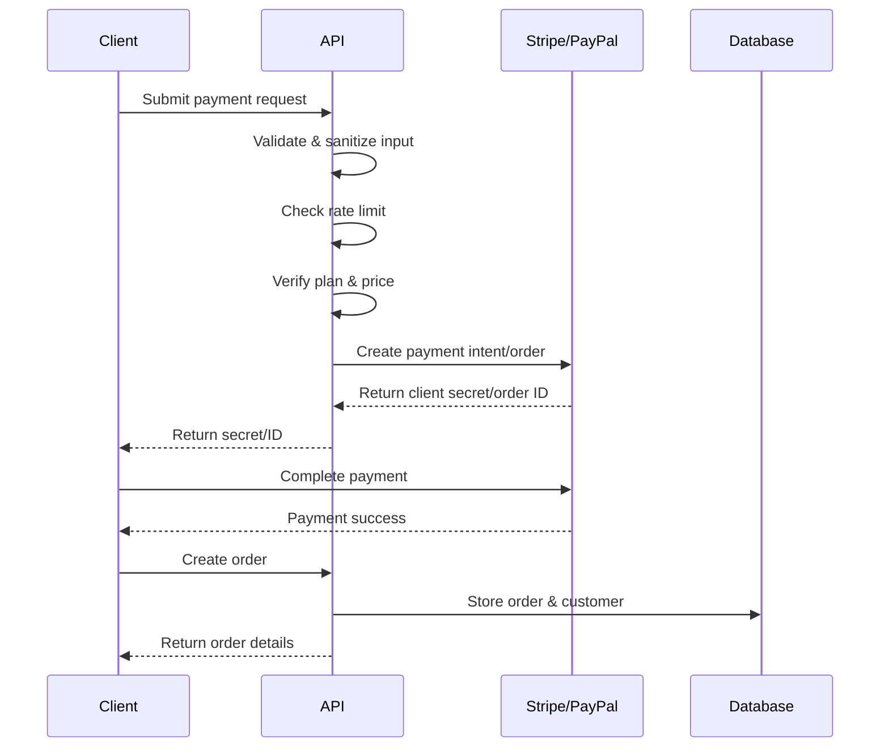

## Overview

Connect World supports two payment methods: **Stripe** for card payments and **PayPal** for PayPal account payments. Both integrations include comprehensive security measures, rate limiting, and price validation.

<CardGroup cols={2}>
  <Card title="Stripe" icon="stripe">
    Credit and debit card processing with automatic payment methods
  </Card>
  <Card title="PayPal" icon="paypal">
    PayPal account payments with order capture flow
  </Card>
</CardGroup>

## Payment Methods

Payment methods are defined as a union type:

```typescript
export type PaymentMethod = "stripe" | "paypal";
```

Source: `src/domain/entities/Order.ts:1`

## Stripe Integration

### Payment Intent Creation

The Stripe API endpoint creates payment intents with comprehensive validation:

```typescript
export async function POST(req: NextRequest) {
  // Rate limit: 10 payment-intent attempts per IP per 15 minutes
  const ip = getClientIp(req);
  if (!checkRateLimit(`stripe:${ip}`, 10, 15 * 60 * 1000)) {
    return NextResponse.json(
      { error: "Demasiadas solicitudes. Intenta de nuevo en unos minutos." },
      { status: 429 }
    );
  }

  try {
    const body = await req.json();

    const planId = sanitizeString(body.planId, 50);
    const months = sanitizeNumber(body.months, 1, 12);
    const amount = sanitizeNumber(body.amount, 1, 10000);

    // Validation logic...

    const paymentIntent = await stripe.paymentIntents.create({
      amount: Math.round(amount * 100),
      currency: "usd",
      automatic_payment_methods: { enabled: true },
      metadata: { planId, months: String(months) },
    });

    return NextResponse.json({ clientSecret: paymentIntent.client_secret });
  } catch (error: unknown) {
    // Error handling...
  }
}
```

Source: `src/app/api/stripe/route.ts:11-60`

### Stripe Configuration

```typescript
import Stripe from "stripe";

const stripe = new Stripe(process.env.STRIPE_SECRET_KEY!);
```

Source: `src/app/api/stripe/route.ts:7`

<Note>
  The Stripe secret key must be configured in your environment variables as `STRIPE_SECRET_KEY`.
</Note>

### Valid Payment Durations

```typescript
const VALID_MONTHS = [1, 2, 3, 6, 12] as const;
```

Source: `src/app/api/stripe/route.ts:9`

## PayPal Integration

### Order Creation Flow

PayPal uses a two-step process: create order, then capture payment.

<Tabs>
  <Tab title="Create Order">
    ```typescript
    export async function POST(req: NextRequest) {
      // Rate limit: 10 PayPal order creations per IP per 15 minutes
      const ip = getClientIp(req);
      if (!checkRateLimit(`paypal-create:${ip}`, 10, 15 * 60 * 1000)) {
        return NextResponse.json(
          { error: "Demasiadas solicitudes. Intenta de nuevo en unos minutos." },
          { status: 429 }
        );
      }

      // Validation and sanitization...

      const accessToken = await getPayPalAccessToken();

      const orderPayload = {
        intent: "CAPTURE",
        purchase_units: [
          {
            amount: { currency_code: "USD", value: String(Number(amount).toFixed(2)) },
            description: `Connect World Plan ${planId} ${months}mo`,
          },
        ],
      };

      const { data } = await axios.post(
        `${PAYPAL_BASE}/v2/checkout/orders`,
        orderPayload,
        {
          headers: {
            Authorization: `Bearer ${accessToken}`,
            "Content-Type": "application/json",
          },
        }
      );

      return NextResponse.json({ id: data.id });
    }
    ```
    
    Source: `src/app/api/paypal/create-order/route.ts:29-101`
  </Tab>
  
  <Tab title="Capture Order">
    ```typescript
    export async function POST(req: NextRequest) {
      try {
        const { orderId } = await req.json();

        const accessToken = await getPayPalAccessToken();

        const { data } = await axios.post(
          `${PAYPAL_BASE}/v2/checkout/orders/${orderId}/capture`,
          {},
          {
            headers: {
              Authorization: `Bearer ${accessToken}`,
              "Content-Type": "application/json",
            },
          }
        );

        return NextResponse.json({ id: data.id, status: data.status });
      } catch (error: unknown) {
        // Error handling...
      }
    }
    ```
    
    Source: `src/app/api/paypal/capture-order/route.ts:25-54`
  </Tab>
</Tabs>

### PayPal Authentication

PayPal requires OAuth2 authentication for each API request:

```typescript
async function getPayPalAccessToken(): Promise<string> {
  const credentials = Buffer.from(
    `${process.env.NEXT_PUBLIC_PAYPAL_CLIENT_ID}:${process.env.PAYPAL_CLIENT_SECRET}`
  ).toString("base64");

  const { data } = await axios.post(
    `${PAYPAL_BASE}/v1/oauth2/token`,
    "grant_type=client_credentials",
    {
      headers: {
        Authorization: `Basic ${credentials}`,
        "Content-Type": "application/x-www-form-urlencoded",
      },
    }
  );

  return data.access_token;
}
```

Source: `src/app/api/paypal/create-order/route.ts:10-27`

### PayPal Configuration

```typescript
const PAYPAL_BASE = process.env.PAYPAL_BASE_URL ?? "https://api-m.sandbox.paypal.com";
```

Source: `src/app/api/paypal/create-order/route.ts:7`

<Warning>
  Configure `PAYPAL_BASE_URL` to point to production (`https://api-m.paypal.com`) when going live.
</Warning>

## Security Features

### Input Sanitization

All payment inputs are sanitized to prevent injection attacks:

```typescript
import { sanitizeNumber, sanitizeString } from "@/lib/sanitize";

const planId = sanitizeString(body.planId, 50);
const months = sanitizeNumber(body.months, 1, 12);
const amount = sanitizeNumber(body.amount, 1, 10000);
```

Source: `src/app/api/stripe/route.ts:4, 24-26`

### Sanitization Functions

<Accordion title="Input Sanitization Implementation">
  ```typescript
  /** Strip HTML tags and control characters, trim, enforce max length */
  export function sanitizeString(value: unknown, maxLength = 200): string {
    if (typeof value !== "string") return "";
    return value
      .trim()
      .replace(/<[^>]*>/g, "")          // strip HTML tags
      .replace(/[\x00-\x08\x0B\x0E-\x1F\x7F]/g, "") // strip control chars
      .slice(0, maxLength);
  }

  /**
   * Validate a number within an inclusive range.
   * Returns null if invalid.
   */
  export function sanitizeNumber(value: unknown, min: number, max: number): number | null {
    const n = Number(value);
    if (!isFinite(n) || n < min || n > max) return null;
    return n;
  }
  ```
  
  Source: `src/lib/sanitize.ts:6-37`
</Accordion>

### Rate Limiting

Both payment endpoints implement rate limiting to prevent abuse:

```typescript
export function checkRateLimit(key: string, maxReqs: number, windowMs: number): boolean {
  const now = Date.now();
  const entry = store.get(key);

  if (!entry || now > entry.resetAt) {
    store.set(key, { count: 1, resetAt: now + windowMs });
    return true;
  }

  if (entry.count >= maxReqs) return false;

  entry.count += 1;
  return true;
}
```

Source: `src/lib/rateLimiter.ts:30-43`

<CardGroup cols={2}>
  <Card title="Stripe Rate Limit" icon="shield-halved">
    10 payment intents per IP per 15 minutes
  </Card>
  <Card title="PayPal Rate Limit" icon="shield-halved">
    10 order creations per IP per 15 minutes
  </Card>
</CardGroup>

### Price Validation

Critical security feature: server-side price verification prevents price tampering:

```typescript
// Validate planId exists and months is a valid duration
const plan = PLANS.find((p) => p.id === planId);
if (!plan) {
  return NextResponse.json({ error: "Plan inválido." }, { status: 400 });
}
if (!(VALID_MONTHS as readonly number[]).includes(months)) {
  return NextResponse.json({ error: "Duración inválida." }, { status: 400 });
}

// Validate amount matches the real price (prevents price tampering)
const expectedPrice = plan.prices.find((p) => p.months === months)?.price;
if (expectedPrice === undefined || Math.abs(amount - expectedPrice) > 0.01) {
  return NextResponse.json({ error: "Monto inválido." }, { status: 400 });
}
```

Source: `src/app/api/stripe/route.ts:33-45`

<Warning>
  **Never trust client-provided prices.** Always validate against server-side plan definitions before processing payments.
</Warning>

## Error Handling

Both payment integrations include comprehensive error handling:

<Tabs>
  <Tab title="Stripe Errors">
    ```typescript
    try {
      // Payment processing...
    } catch (error: unknown) {
      const message = error instanceof Error ? error.message : "Internal server error";
      console.error("[POST /api/stripe]", message);
      return NextResponse.json({ error: message }, { status: 500 });
    }
    ```
    
    Source: `src/app/api/stripe/route.ts:55-59`
  </Tab>
  
  <Tab title="PayPal Errors">
    ```typescript
    catch (error: unknown) {
      const axiosError = error as { response?: { data?: unknown; status?: number } };
      const paypalDetail = axiosError?.response?.data;
      console.error("[PayPal create-order]", paypalDetail ?? error);
      const message = paypalDetail
        ? JSON.stringify(paypalDetail)
        : error instanceof Error
        ? error.message
        : "Failed to create PayPal order";
      return NextResponse.json({ error: message }, { status: axiosError?.response?.status ?? 500 });
    }
    ```
    
    Source: `src/app/api/paypal/create-order/route.ts:90-100`
  </Tab>
</Tabs>

## Payment Flow Diagram



## Environment Variables

<CodeGroup>
```bash Stripe
STRIPE_SECRET_KEY=sk_test_...
```

```bash PayPal
NEXT_PUBLIC_PAYPAL_CLIENT_ID=...
PAYPAL_CLIENT_SECRET=...
PAYPAL_BASE_URL=https://api-m.sandbox.paypal.com
```
</CodeGroup>

<Note>
  Use sandbox URLs for testing and production URLs for live environments.
</Note>

## Best Practices

1. **Always validate prices server-side** - Never trust client-provided amounts
2. **Implement rate limiting** - Prevent abuse and brute force attacks
3. **Sanitize all inputs** - Protect against injection attacks
4. **Use metadata** - Store plan and duration information in payment metadata
5. **Log errors comprehensively** - Include PayPal response details for debugging
6. **Handle edge cases** - Validate plans exist and durations are allowed
7. **Use environment variables** - Never hardcode API keys or secrets
